## 1. 汇报体系介绍

<video src="\ProjectDocs\images\汇报模式.mp4" controls="controls" width="1280" height="720"></video>

## 2. 新建项目

<video src="\ProjectDocs\images\案例创建_batch.mp4" controls="controls" width="1280" height="720"></video>
## 3. 项目创建

## 4.项目打开

## 5.导入模型

	 点击顶部菜单导入按钮，选择需要导入的模型，进行导入

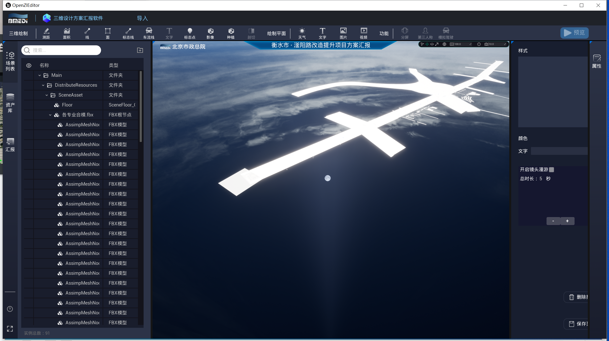

## 6.导入影像数据

点击工具栏中影像，选择地形影像，在右侧属性面板中，这是项目地点的经纬度，点击执行，即可完成导入影像图并设置经纬度信息

## 7.角色操作
	鼠标点击拖拽进行位移，右键点击拖拽进行视角旋转，滚轮缩放控制窗口放大缩小。

## 8.模型操作
	点击右上角编辑组件，进行模型的位移，旋转、缩放

## 9.影像
 开启地形影像

<video src="\ProjectDocs\images\倾斜摄影_batch.mp4" controls="controls" width="1280" height="720"></video>
 点击顶部功能菜单栏选择影像，选择地形影像，在右侧输入项目确定好的经纬度，点击右下角执行，即可完成影像加载。 

 参考实例  衡水 （  115.6611  ,  37.715  ,  20  ）分布对应精度维度高度；

也可以点击坐标中的拾取坐标，拾取场景中的经纬度中心点，来进行设置中心点

 如需更新经纬度，重复上述操作即可，

##  10.添加倾斜摄影数据

<video src="\ProjectDocs\images\倾斜摄影_batch.mp4.mp4" controls="controls" width="1280" height="720"></video>
  用户点击影像，选择倾斜摄影数据，用户输入倾斜摄影路径，点击执行即可完成倾斜摄影数据的导入

   地址参考：   file:///D:/BaiduNetdiskDownload/3DTile/3DTile/Data/scene.json

## 11.植被系统

-  ### 11.1单个植被

- ### 11.2沿线种植

- ### 11.3笔刷种植

## 12天气系统

<video src="\ProjectDocs\images\天气_batch (1).mp4" controls="controls" width="1280" height="720"></video>

点击顶部工具栏中天气选项，再右侧属性面板中，可选择对应的效果进行调整。

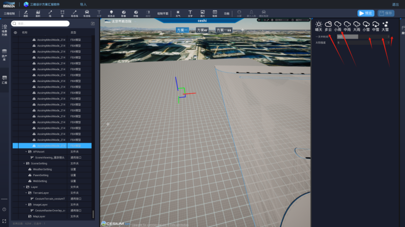

## 13添加文字

点击文字，可快速在页面上生成示意文本；

点击场景列表，查找刚刚创建的文本组件，在右侧进行文字编辑和颜色大小位置的调整。

## 14 添加图片说明

点击图片，可快速在页面上生成示意图片；

点击场景列表，查找刚刚创建的图片组件，在右侧进行图片编辑和颜色大小位置的调整。

## 15 添加视频说明

点击视频，可快速在页面上生成示意窗口；

点击场景列表，查找刚刚创建的视频组件，在右侧进行大小位置的调整。和视频源的选择

## 16材质编辑并另为

- 打开资产库
- 选择资产库
- 选择母材质
- 选择基本材质
- 在右侧属性面板进行调整基础属性
- 点击右下角另存为，并重命名好材质命名
- 即可完成材质的二次编辑与保存

另存为的材质在，项目资源->Content->自定义资产->材质中，双击文件夹进行打开。

## 17 材质赋予

- 打开资产库
- 选择资产库
- 选择母材质
- 选择沥青
- 选择材质鼠标拖拽到需要赋予的模型材质
- 松开鼠标
- 即可完成材质赋予

## 18 测距功能

### 视频教程

<video src="\ProjectDocs\images\测距.mp4" controls="controls" width="1280" height="720"></video>

用户点击顶部功能栏选择测距，进入鼠标编辑模式。用户可直接在场景中进行点击，最后鼠标按下鼠标中键，完成测量。

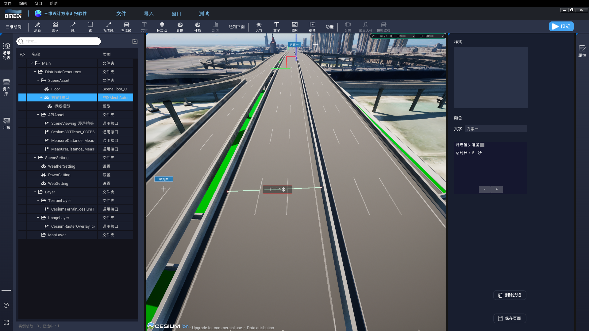

点击左侧场景列表，找到"APIAsset"找到刚刚创建的测距，点击。即可在右侧进行属性编辑；

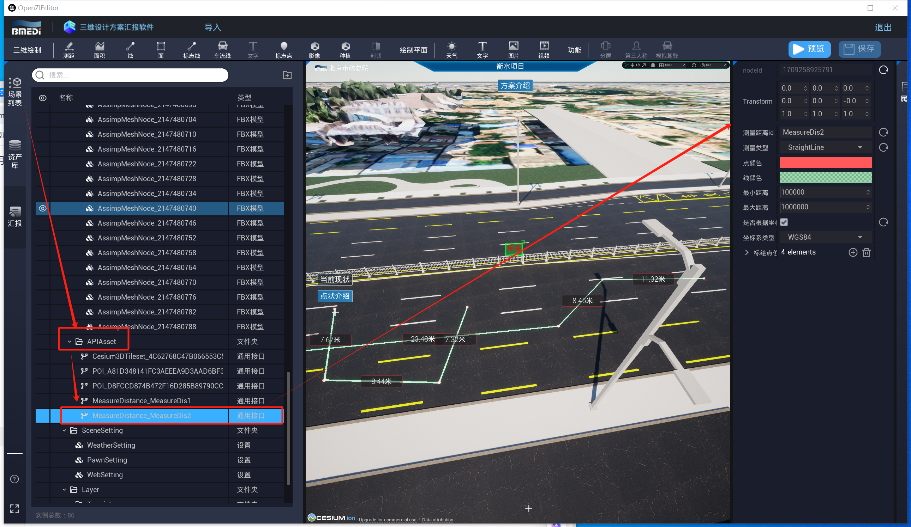

通过右侧属性面板可以设置测距的颜色样式。

点击左侧场景列表，找到"APIAsset"找到刚刚创建的测距，点击列表前方小眼睛，进行显示隐藏展示，按下键盘Del即可在完成删除操作。

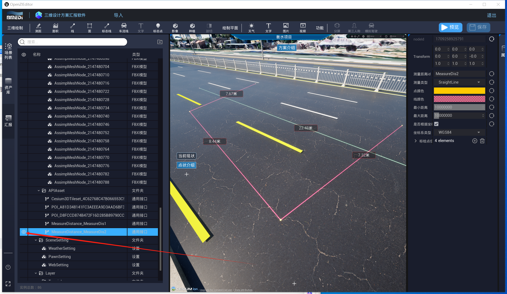

## 19绘制线

<video src="\ProjectDocs\images\示意线.mp4" controls="controls" width="1280" height="720"></video>

**点击顶部线功能按钮，可直接鼠标在场景中点击绘制，鼠标中键结束绘制**

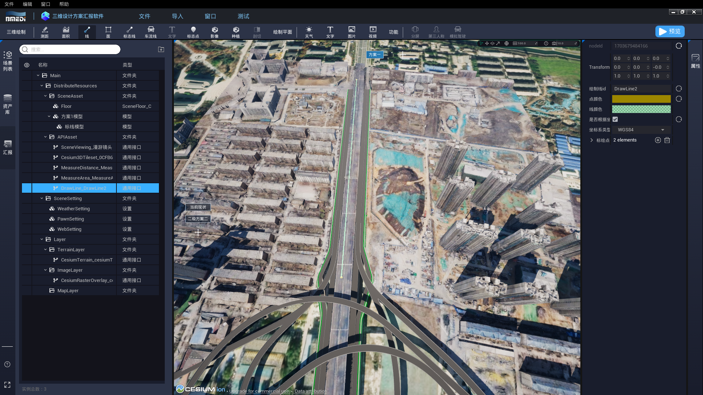

右侧属性面板可以调整线段和标记点的颜色

**点击对应按钮点击保存页面完成线段绘制**

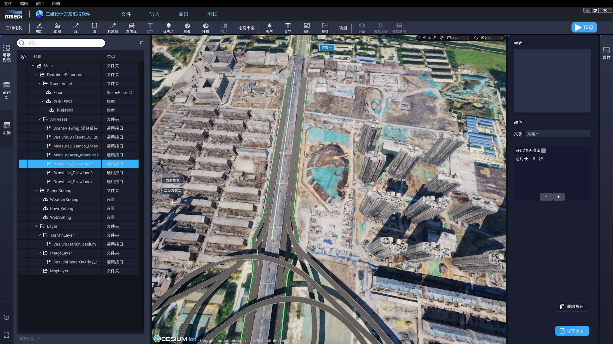

## 20 绘制面

**点击顶部面功能按钮，可直接鼠标在场景中点击绘制，鼠标中键结束绘制**

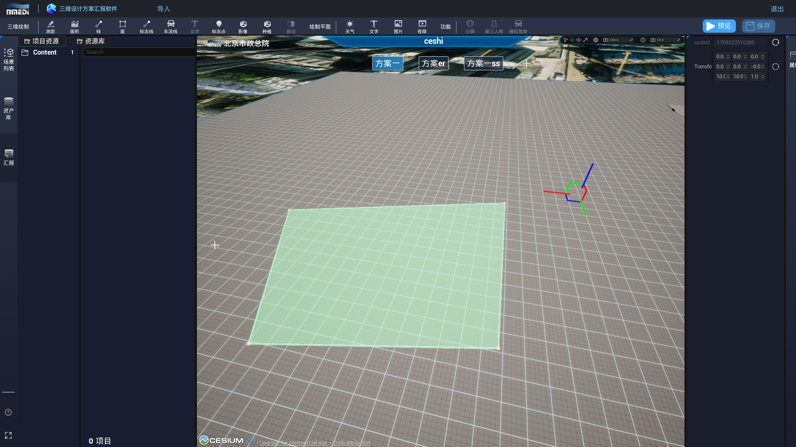

**右侧属性面板可以调整线段和面板的颜色**

**点击对应按钮点击保存页面完成线段绘制**

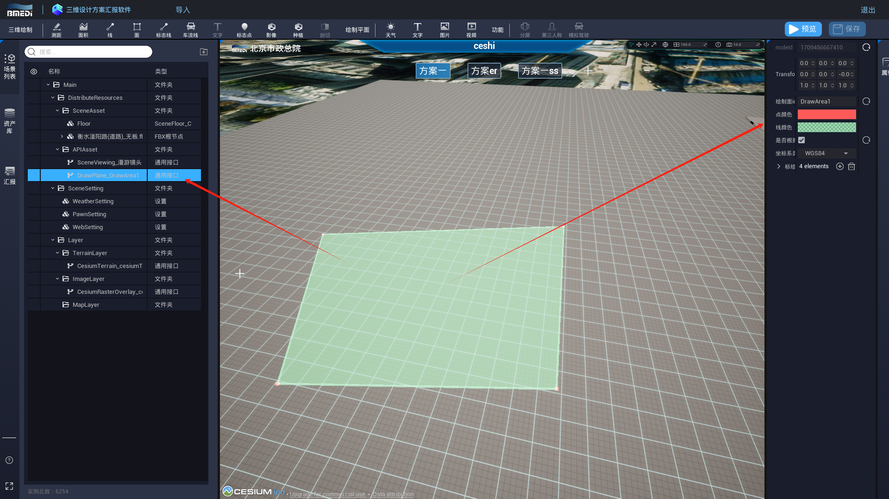

## 21标记线

### 视频教程

<video src="\ProjectDocs\images\箭头线.mp4" controls="controls" width="1280" height="720"></video>

 ### 箭头线

- 选择标记线

- 右侧属性面板，调整相关信息，找到箭头信息

- 清空箭头信息坐标

- 鼠标右键，点击pick up

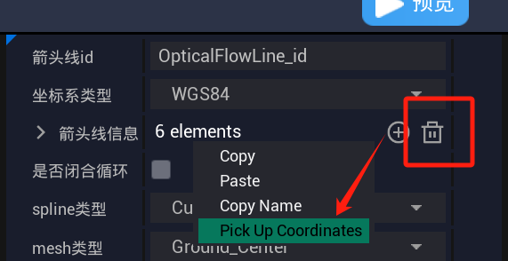

坐标点拾取   拾取完成后 ，点击退出坐标拾取模式，

点执行，即可完成样条线操作。

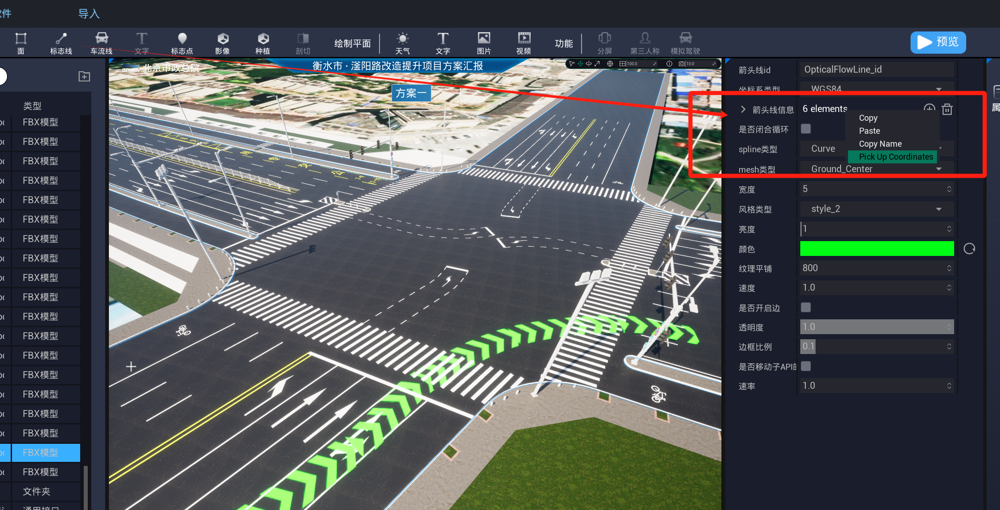

 ### 地理围栏绘制

点击顶部围栏，在右侧选择坐标绘制位置，绘制完毕后退出坐标选择。点击右下角执行，即可完成地理围栏绘制。

## 22 车流线

### 视频教程

<video src="\ProjectDocs\images\车流线绘制.mp4" controls="controls" width="1280" height="720"></video>

####  车流线绘制

 点击车流线

 在右侧属性面板 按住Shift 鼠标多选车辆

 调整相关属性，也可以默认

 点击右下角执行

 鼠标返回场景窗口，在适当位置进行点选

 键盘wasd按键控制视角变化，也可以鼠标按下后不松开，进行拖拽编辑

 按下鼠标中建，完成绘制，再次按下鼠标中键，隐藏示意线。

#### **车流线编辑**

 在场景列表中，选择刚刚创建的车流线

 在右侧属性面板中调整参数

## 23  POI点		

### 视频教程

<video src="\ProjectDocs\images\标记点.mp4" controls="controls" width="1280" height="720"></video>

#### 快速入门

1. 选择工具标记点
2. 右侧属性面板选择喜欢的样式
3. 鼠标移动到poi坐标处，右键，
4. 选择 Pick Up Coordinates, 
5. 进入坐标拾取模式，
6. 点击右下角的退出坐标拾取模式，
7. 点击右下角的执行按钮，
8. 即可完成坐标点的绘制。

#### 标记点内容编辑

 场景列表中选择刚刚创建的标记点

 一般会在APIAsset文件中，叫做poi_xxxxxx类似的名字，选中以后可以在右侧属性面板中进行二次调整。

## 24 发布导出

1.首先确定文件结构中是否拥有 OpenZIEditor.zip的项目文件。

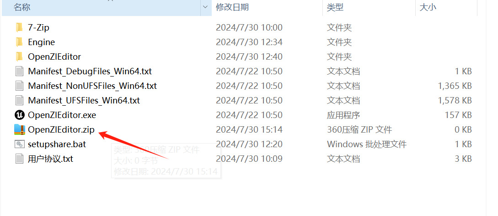

 2.如果没有双击，文件中 setupshare.bat  脚本文件生成发布所需的资源文件。（大概1~3分钟）

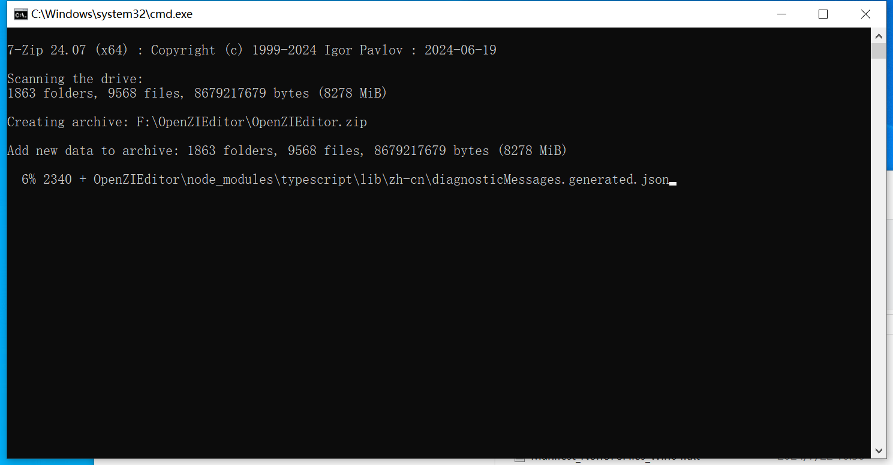

3.启动程序，点击省略号，点击分享，选择生成路径，等待执行完成。（生成时间根据项目大小决定，制作时间大概在1~5分钟）

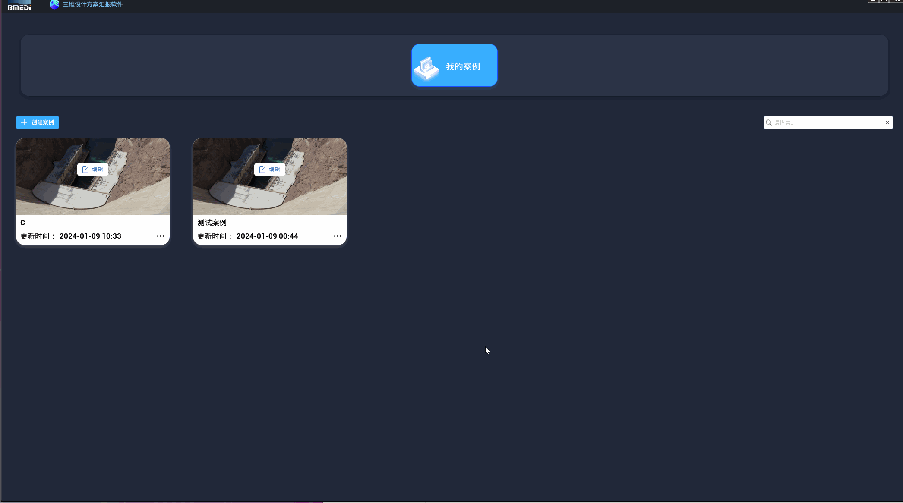

 4.如果长时间无法导出项目，请参考第一步，确定文件夹中是否正确生成了配置文件压缩包。

## 25方案保存

## 26分屏对比

<video src="\ProjectDocs\images\%E5%88%86%E5%B1%8F%E5%AF%B9%E6%AF%94.mp4" controls="controls" width="1280" height="720"></video>

## 27第一人称

1.点击图标进入第一人称模式

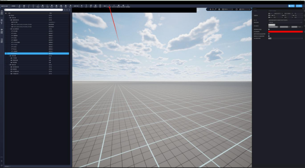 

2.WASD控制视角移动，按住鼠标左键或者右键旋转视角

 

 

## 28 第三人称

1点击图标进入第一人称模式

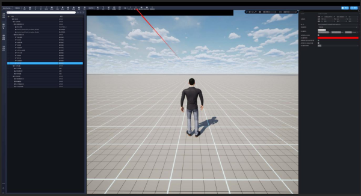 

2.WASD控制视角移动，按住鼠标左键或者右键旋转视角

## 29 模拟驾驶内

1.点击图标进入模拟驾驶内模式
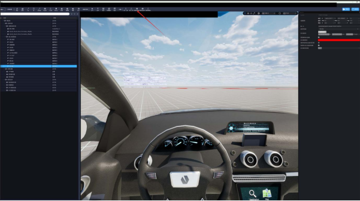 

2.WASD控制视角移动，按住鼠标左键或者右键旋转视角

 

## 30 模拟驾驶外

1.点击图标进入模拟驾驶外模式

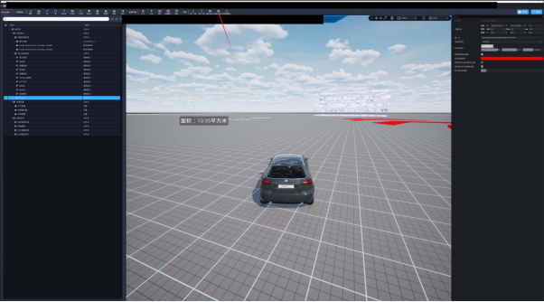 

**●** ***\*2.\*******\*WASD控制视角移动，按住鼠标左键或者右键旋转视角\****

## 31 观察者模式

1.点击图标进入观察者模式

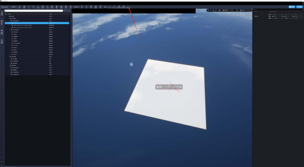 

2.WASD控制视角移动，滑动鼠标滚轮键改变视角大小，按住鼠标右键旋转视角，按住鼠标左键平移视角。\****

## 32 轮播图片

1.点击图标创建轮播图片

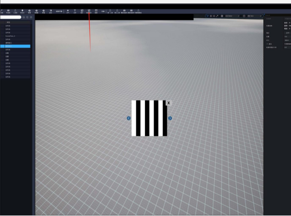 

2.左侧场景列表选中轮播图片

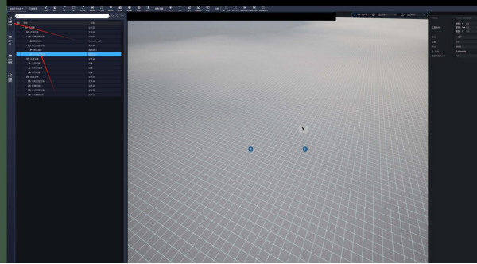 

3.右侧面板中点开路径，选择图片的路径。点击屏幕中间的蓝色箭头切换显示图片。

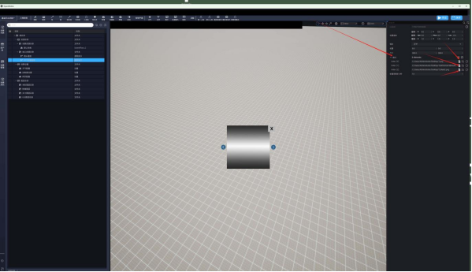 

## 33剖切

1点击图标进入创建剖切盒体界面

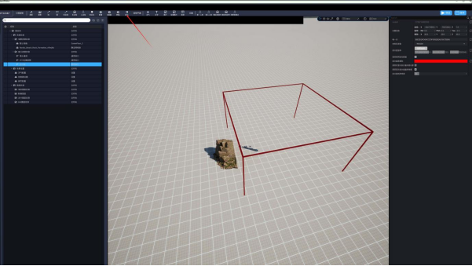 

2依次点击拾取坐标，鼠标点击地面拾取，退出坐标拾取，执行。完成剖切盒体创建。

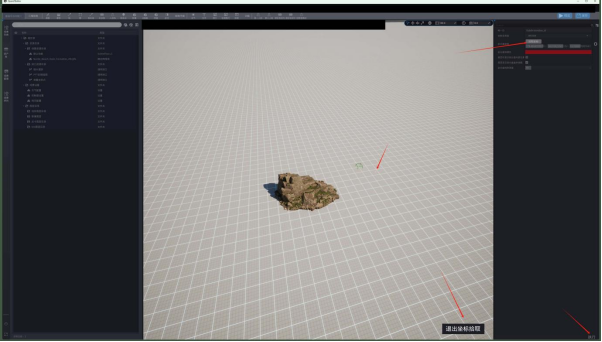 

3将带有剖切材质的模型移动到盒体内，实现剖切效果。

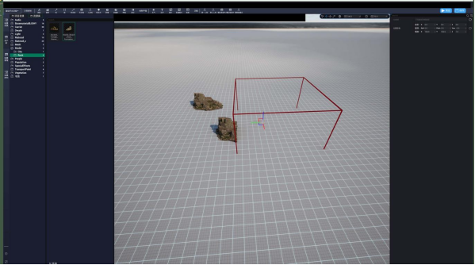 

 

 

## 34 OD线

1. 点击图标进图OD线创建界面

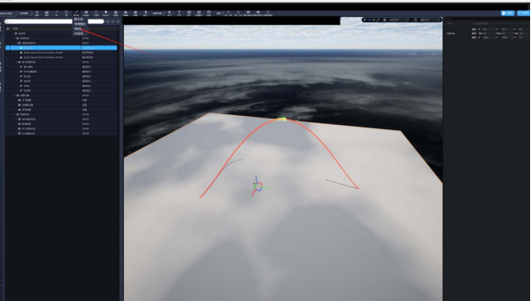 

2. 依次点击拾取OD线起点坐标，点击地面拾取点位，退出坐标拾取。

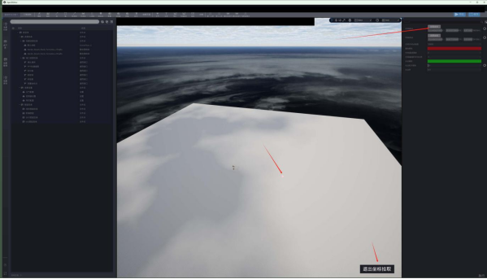 

3. 点击拾取OD线终点坐标，点击地面拾取点位，退出坐标拾取，执行。完成OD线创建。

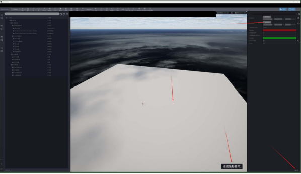 

## 35 光流线

1. 点击图标进入光流线创建界面

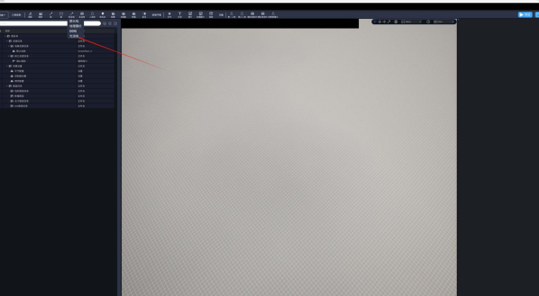 

2. 依次点击拾取坐标，在场景中拾取点位，退出坐标拾取，执行。完成光流线创建。

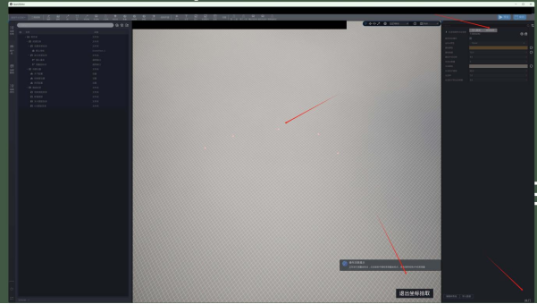 

3. 在左侧场景列表，选中光流线，右侧细节面板中修改线条半径，和粒子半径。

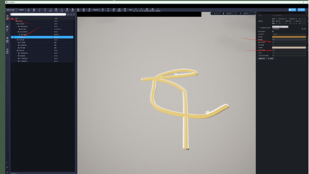 

 

 