# 软件安装


## 硬件配置


> 在开始使用三维设计方案汇报软件之前，请确保您的计算机符合以下最低系统要求：

```Plain
建议配置：
    CPU：24核
    内存：64GB
    显卡： 
        RTX3090、RTX3090Ti、RTX4060Ti（显存16G）、
        RTX 4070 Ti SUPER、RTX 4080、RTX 4080 SUPER、RTX 4090D、RTX 4090

最低配置：
    CPU：16核及以上
    内存：32GB及以上
    显卡：RTX3060及以上（显存12GB以上）
```

## 安装说明（测试版）

###  	1. 解压与安装  用户选择压缩包文件进行解压，选择解压到“版本名称.zip 文件”

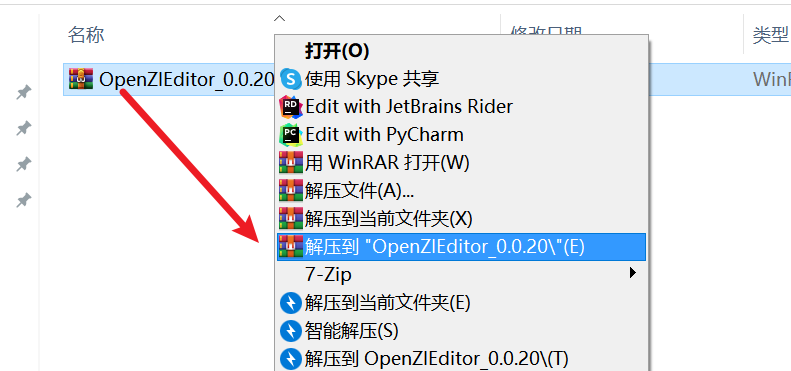 

### 2.会自动解压形成文件夹，然后将压缩包剪切到项目目录中


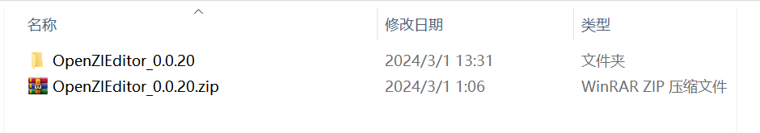


### 3. 选择刚刚解压的压缩包，剪切到刚刚解压缩后的文件夹当中，如图所示


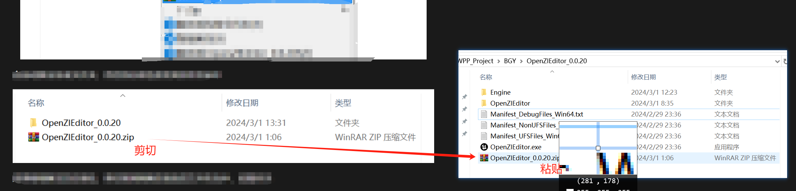


### 4. 创建快捷方式  选择"`OpenZIEditor.exe`" 右键->发送到->桌面快捷方式


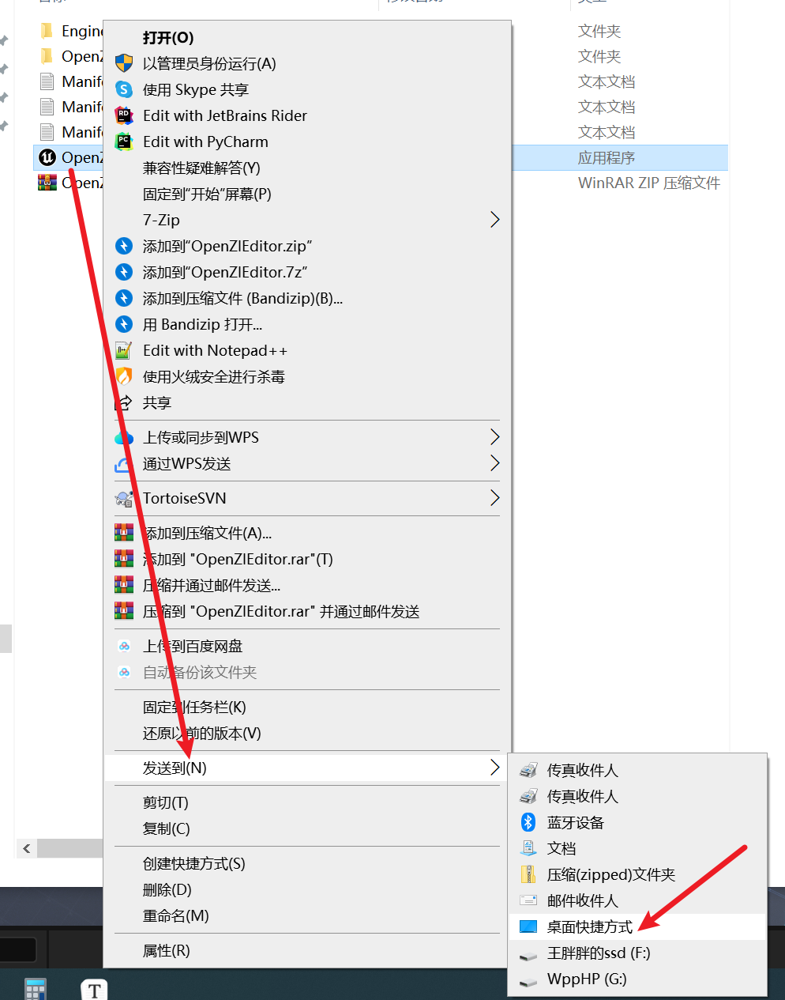

### 5. 运行  返回桌面，找到刚刚创建的快捷方式，右键打开即可完成安装

 如果您在安装过程中遇到任何问题或有任何疑问，请随时联系我们的技术支持团队，我们将竭诚为您解答和提供帮助。

## 安装说明（最新版）

### 1.下载：

[更新日志与下载](./ProjectDocs/更新日志与下载.md)

### 2.文件构成：

安装文件为安装包文件和，编译文件。

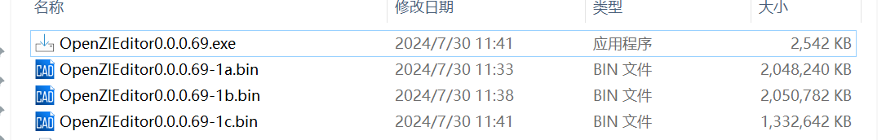

### 3.注意事项：

完成安装这一步时间较长，请耐心等待，大概会在3~5分钟左右。

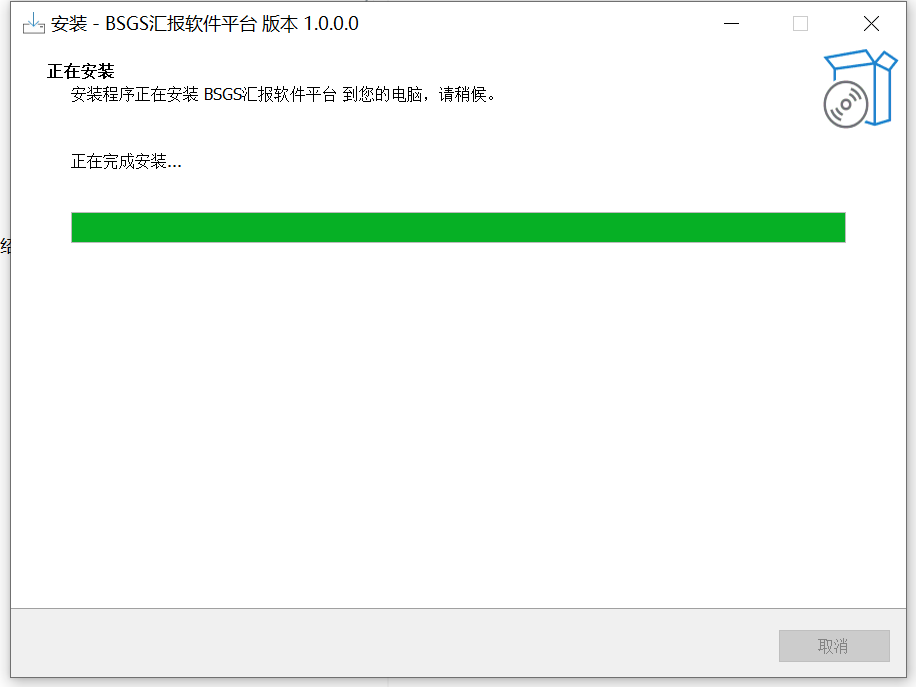

###  4安装：

#### 1.右键打开OpenZIEditor X.X.X.X.exe

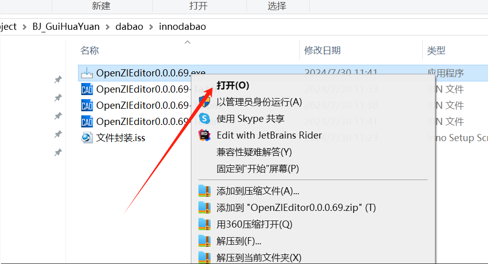

#### 2.同意协议：

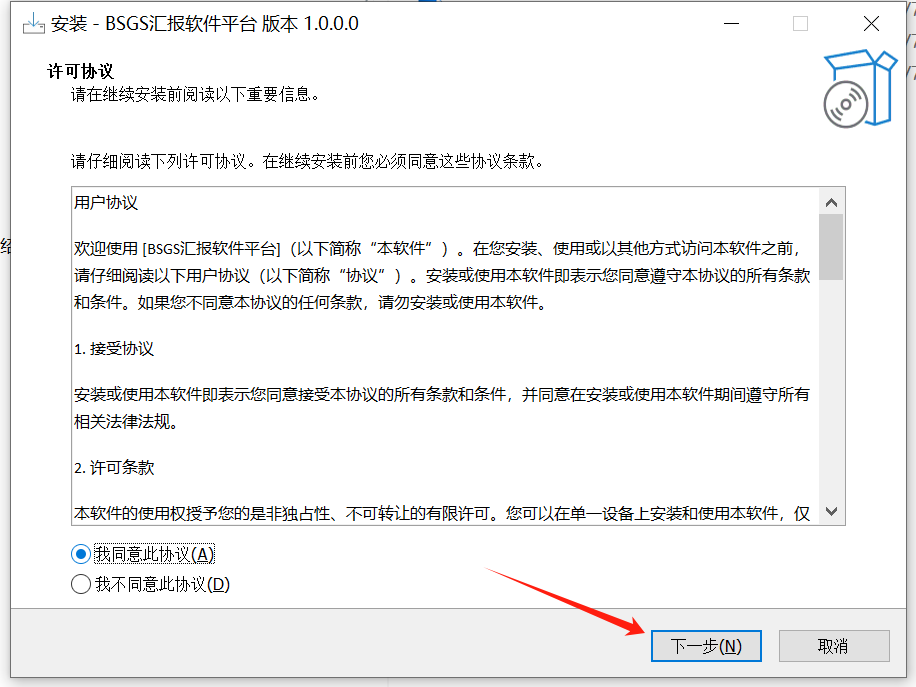

#### 3.选择安装路径：

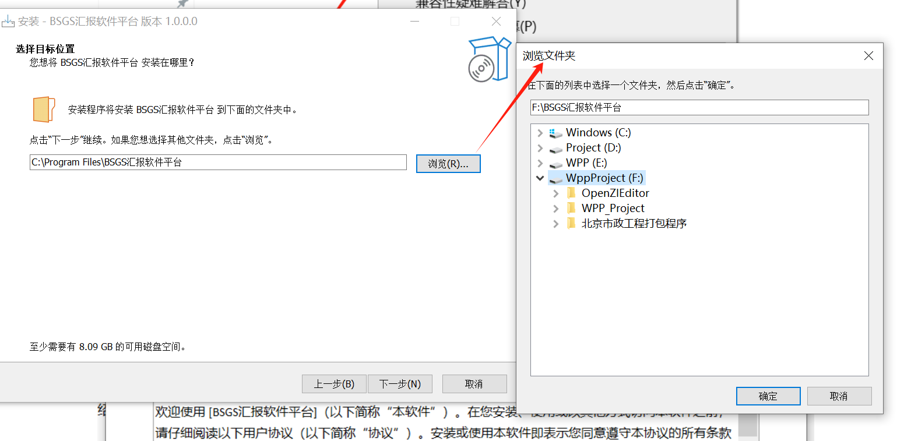

​	

#### 4. 下一步：

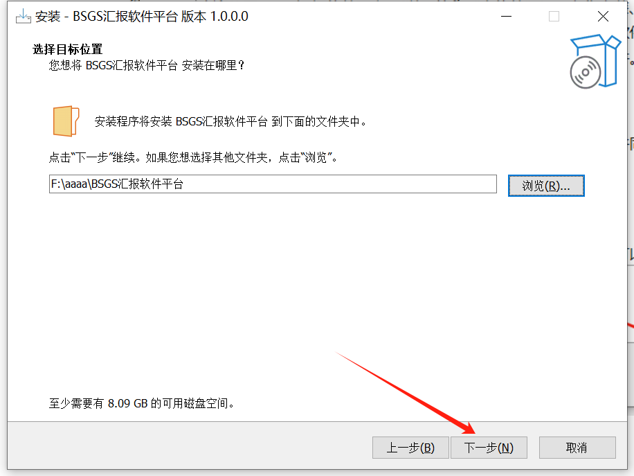

​	

#### 5.创建快捷方式：

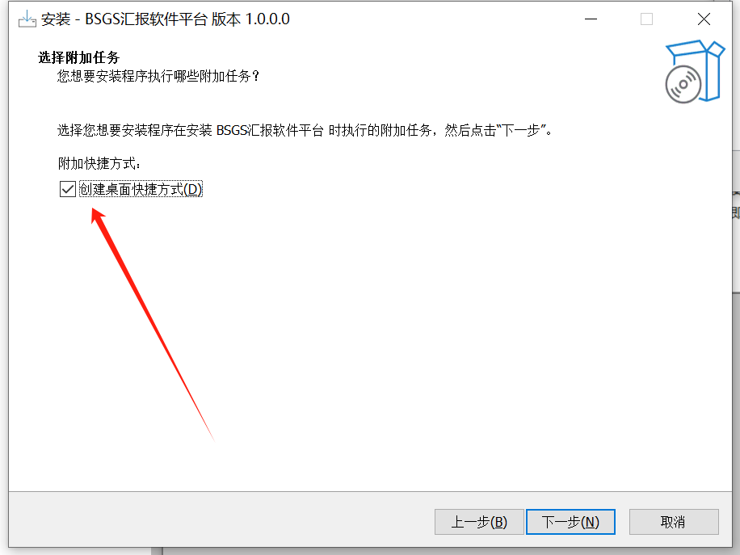

#### 6.安装：

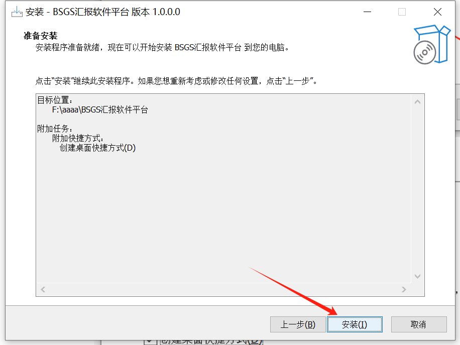

​	

#### 7. 安装：

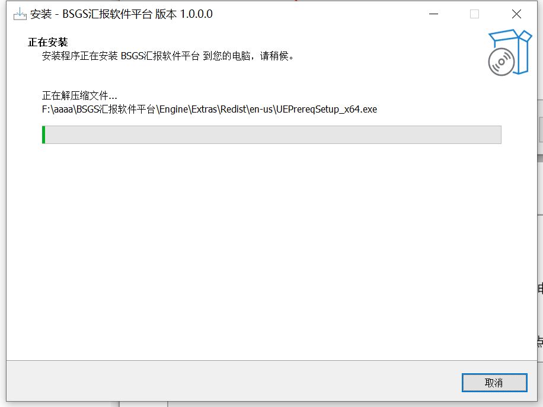

​	

#### 8.运行：

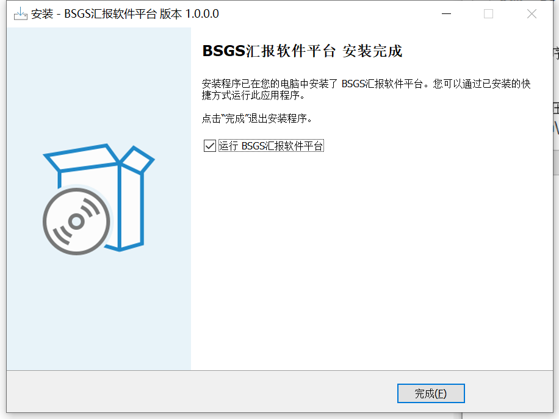

