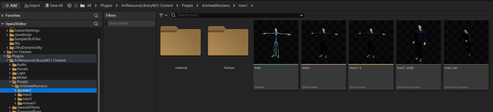

# 高级功能

## POI 图标资源更新与替换

找到案例工程，依次打开以衡水项目为例，依次打开`“衡水项目\Resource\Texture”`


 用户可直接找到对应 poi 图标样式进行修改与替换


# 自定义资源打包

## 概述

- 将虚幻引擎的资源打包成资源包，方便以资源库的方式使用资源
- 支持符合资源命名的规则的任何资源
- 虚幻Level资源有例外，下文详述

## 资源存放规则

- 资源可以存放在项目的任何位置，但需要符合如下规则：
- 文件夹名称和资源名称一致，例如：
  
- 该资源依赖的所有资源需要都放在同名文件夹下，可以再创建子文件夹，例如：
- 

如果资源项目所有资源都是按照上诉规则存放，那么只需要执行`打包操作`，即可打包出对应的资源包。  
否则执行`资源迁移`的方式，将资源迁移到在另一个项目，再打包即可。

```
！！！强烈建议采用资源迁移的方式打包，可以避免资源依赖关系错误的问题。
```

## 资源迁移

- 创建一个同版本的虚幻项目（新项目名：PackAsset）
- 拷贝本插件到PackAsset项目中的Plugins目录下
- 如果资源依赖项目中的插件，则需要将插件复制到PackAsset项目中。
  
- 选择需要迁移的资源，引擎Engine资源不需要迁移
  
- 迁移到PackAsset项目Content目录下
  
- 由于资源不符合上诉资源存放规则，需要移动资源符合上诉规则，这一步也能检查资源依赖关系是否正确，打开资源检查一下
  
- 修复重定向错误  
  
- 建议再执行一次Resave All  
  
- 通过Reference Viewer查看器检查所有依赖资源是否都在本资源目录下
  
- 

## 执行打包

## 


打包完成后复制到程序包的Assets目录下  


## 多语言配置表

- `AssetLibrary.zh.ltext`这个文件的`AssetLibrary`文件名可以任意命名
- 也可以将多个配置表合并在一个文件里面
- 也可以多个`*.zh.ltext`文件

## 打包Level资源

- 同样需要符合资源存放命名规则，即文件名和文件夹名一致，例如：
- 
- 与其他资源不同的是，打包Level资源会自动寻找所有依赖的资源，并打包成一个资源包
- 不需要符合所有资源都放在本资源文件夹下

## 打包材质资源

- 只支持材质实例资源打包
- 支持材质暴露参数自动提取，保持和编辑器下材质参数排序和分类
- 材质参数中文显示名配置：在程序包的Content目录下，修改MaterialParameter.zh.ltext里的内容，添加材质参数的显示名
- 示例：如果没有该文件，可以创建这样一个文件

```json
{
  "$$MaterialParameterNames$$": {
    "saturability": {
      "source": "",
      "translation": "饱和度"
    },
    "Grayscale": {
      "source": "",
      "translation": "灰度"
    }
  }
}
```

## 打包蓝图Actor资源

- 每个需要暴露的参数需要勾选SaveGame
  
- 暴露蓝图参数，支持除了UObject类型参数外的所有类型参数

